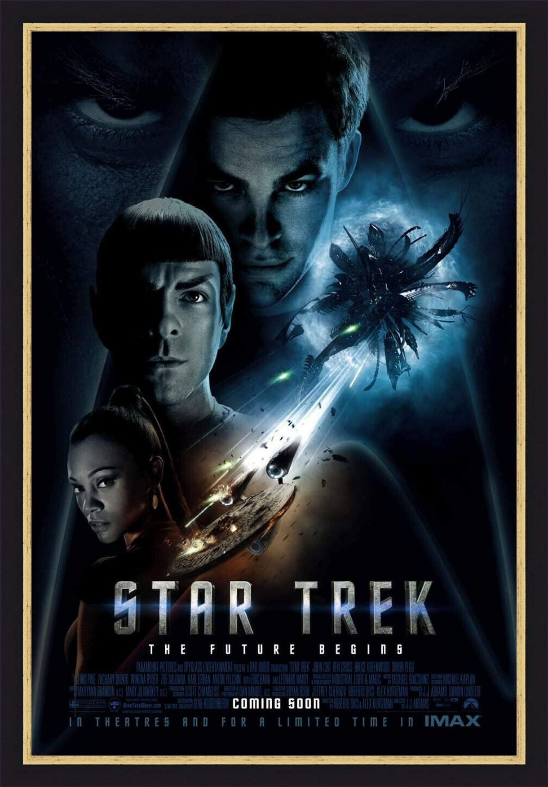
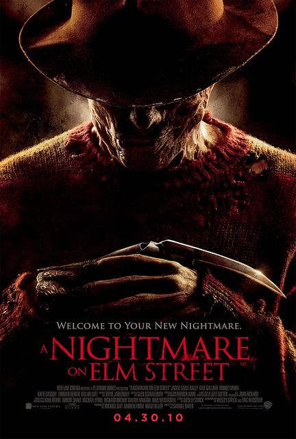

Imagine you’ve left the cinema, still with the taste of lightly salted popcorn lingering in your mouth, and a slight sense of dizzy disorientation as your eyes adjust to the light outside. While you allow your catharsis to wash over you, you think back to the movie you just watched, to the plot, and to its characters. But what made you go and see that movie in the first place?

More often then not, it was the movie’s poster itself that originally enticed you, with its striking imagery and distinctive writing . Whether on the side of a bus or in the back of a newspaper, it instilled in you enough interest and curiosity to reach into your pockets and spend the precious £7. 

But why is that?

Much like a book cover, a movie poster gives you your first impression of a film. Providing you with a preview into what is to come, whilst also setting the tone and pace for the movie. Ultimately, it hopes to grab your attention with eye-catching imagery and cohesive seductive lettering, and done properly a movie poster can be instrumental to the success of a film.

Within the context of movie poster design, there are many facets to consider, not least of these is typography. Typefaces are everywhere and are used as a key marketing technique, they guide us, tempt us and shape the way we see the world. The typeface chosen is essential to the marketability and success of the movie poster. It should not interfere with the message being conveyed, but rather enhance it. For instance, this could be the use of tall clean lettering with a metallic finish to indicate a sci-fi movie, or a more delicate subtle typeface such as Trajan for a thriller/horror film.

Thusly, with each genre comes its own distinctive font type, that gives the viewer a clear reflection of the movie and its themes. The trends in typography are clear to see in any movie poster genre. Just by typing in ‘action movie posters’ into Google images you are suddenly flooded by striking images of the movie’s protagonist spanning the length and breath of the page. Here the typefaces are thick to reflect the heroes’ strength whilst also helping to emphasise the main character dominance, not only on the poster but later on in the movie.

But it is not simply just with this genre that there are trends in the typographic design. Across the board you can see a visible pattern in the font types used in movie posters, as each style evokes a different emotion and in turn targeting a different audience.

So next time you are gazing up at a poster for an upcoming movie, I ask you to first look at the title and think what is this telling me?