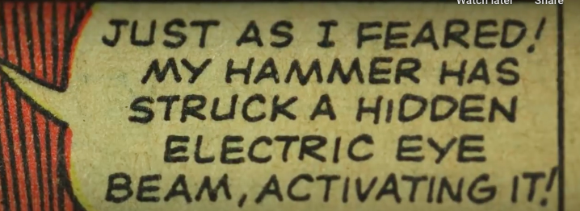
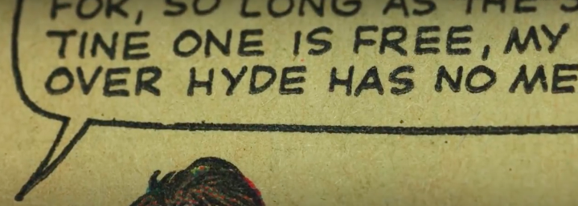
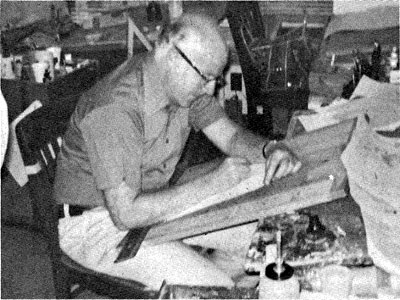
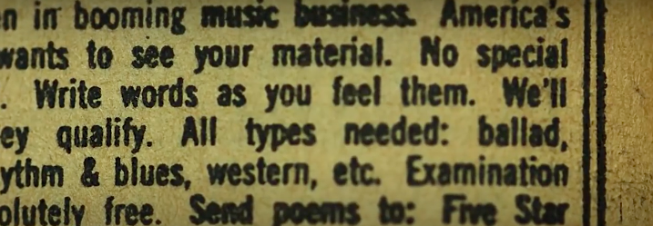

Comic book culture, especially that consisting of super heroes and villains, has been around in our lives for nearly a century. Whether it has been the companion on a long journey, or the comforting voice to help you to sleep, comic books are the bread and butter of many children's adolescence. There is something so familiar and distinct about its bright colours and eye-catching writing, the way the illustrations jump out of the page and seem to drag you further into the fantastically world of adventure.

But what makes these pages as unique and memorable as they are?

If you go to a comic book store, pick up one of the many comic books available and open it, the answer will be staring you in the face.On each page there is that famous font that is used in every dialogue bubble. With its soft edges, comical emphasise and signature all caps, this font type has been, and still is, illustrators go to. The characters could be happy, sad, relieved but irregardless of the mood or scene the font in these small bubbles stays the same. As if they have been perfectly preserved inside these sealed bubbles since its first use over 50 years ago.

It’s characteristic style was down to the fact that originally each dialogue bubble was written entirely by hand. Making its first appearance in 1960s Marvel comics which was commonly considered the Golden Age of comic books. Most pages dialogue was primarily lettered by two guys, Artie Simek and Sam Rosen. These gentlemen were arguably the pillar stones to the evolution of comic books, laying the foundation for decades of comic books to come.

Letterers like Simek and Rosen placed and drew expressive dialogue bubbles like this one, that were formed not simply out of their own creative desire but that of necessity. It was, that a lot of practical conditions shaped the artistry of the letters, requiring a font that could cater to the varying size and shape of the dialogue bubbles, whilst also being clear and legible to the reader. But lets take a deeper look at some of the conditions that effected the style of the letters.

Firstly, most letterers used an Ames guide to create their lines, which meant each letter hit the same height. This made letters kind of squat as they were really trying to hit the lines on the top and bottom of the guide. Subsequently, this produced generally rounded Os and fatter As with lower crosses through them.

Secondly, is pens. Earlier letterers also used a Speedball Nib pen or a technical pen and a lot of the time, chose nibs that gave them a consistent stroke width. Consistency really *is* key. Especially when thinking about the sheer quantity of comic books that were being produced during this period.

And last but by no means least, is the quality of pages. Back in the day, the pages that that were used were not as well equipped for closely spaced lower cap letter, with the ink often being blotchy and hard to read. Legibility, like with consistency, was considered vital and all caps fixed that. Making the dialogue clear on lousy paper.

All of these things were made to make comic books printed on bad paper easier to read. And all of those constraints and choices created the handwritten style we know and love today.

But today, with the advancements in technology making such skills obsolete, and are we beginning to lose site of quality for the sake of convenience?