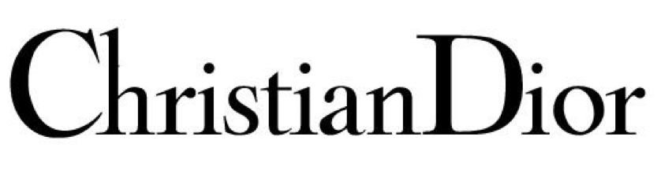
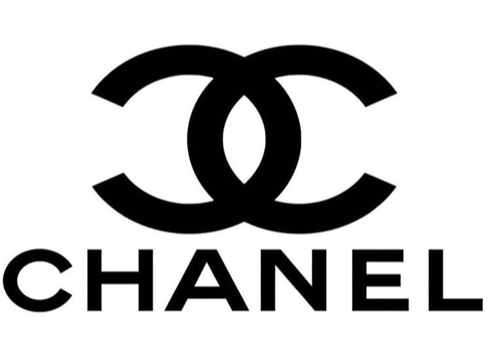
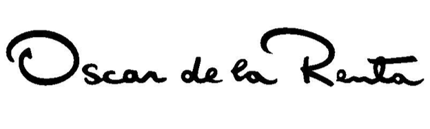
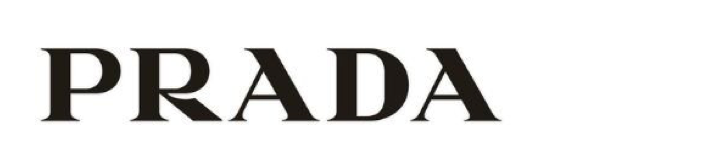

Everywhere you look it is there, plastered up and down the highstreets, swaying on peoples shopping bags or hanging on the back of their clothes. With its eye catching writing, tasteful design and timeless style, screaming both exclusivity and elegance.

This is of course, designer clothing brands.

But how do these brands use typefaces to convey a sense of luxury? What pulls the customer in and holds them there?

Below I will look at several logos of designer clothing brands. Breaking down the individual elements of them and looking at how these in turn aid in the promotion of the brand and its message.

**Dior**

Typeface: Century Gothic

The Dior logo personifies elegance and class, with its clean and precise serifs that serve to emphasise the simple sophistication of the brand. The lettering is lower case with only the first letter, D, capitalized, which is generously curved at the sides, but thinner at the top, similar to the lower case ‘o’. The varying width of the lines, from very think to rather thick, presents a refinement that supports the brand values.

**Channel**

Typeface: Couture

Looking at the Chanel logo and the font used, there are no serifs and the letter thickness does not vary at any point. Unlike the Dior logo, it is entirely capitalized, with each letter equal in width and spacing, giving an air of symmetry. Ultimately presenting a bold and unified font that is both legible instantly recognisable for the customer. The font gives the impression of order and permanence, that though fashion is every evolving and changing, the brand and what it stands for never will.

**Oscar de la Renta**

Typeface: none

The uniqueness of this brand does not simple come from its clothing alone, but also from its logo. Written by hand by the designer himself, it is the essence of intimacy. From the extenuated ‘O’ and ‘R’ to closely interlinks ‘e’s, the logo presents the brand as personal, which is essential when clothes shopping, as it creates a form of trust and familiarity between the brand and the customer. Which, for a global brand such as Oscar de le Renta to be able to do, is invaluable. Shopping is an experience, and you can’t help but feel that by having that particular label on your clothing, you are in on a secret that no one else is and that item of clothing was designed by him for you alone.

**Prada**

Typeface: bespoke modern serif

With the Prada logo being bespoke like some other brands logos, it conveys the brands individuality and sets it above other designers, as there is less overlap in design style. The serifs are horizontal and precise, with the varying width, especially on the ‘A’s giving a sense of modernity. The all caps show the brand to be bold, iconic and distinctive. However, the real eye catching element for me is the chunk that has been taken out of the ‘R’. Almost rendering it into an exact copy of the ‘P’ prior. This almost exact repetition, and the consistency throughout font, presents the brand to be reliable and unwavering.

“Without foundation, there can be no fashion” – Christian Dior

Just like with typography in clothing brands and brands as a whole, they are the foundation to the success and advancement of the company. Brand is everything. It is the first thing you see before even looking at the clothes and it is the lasting reminder on the back of them.