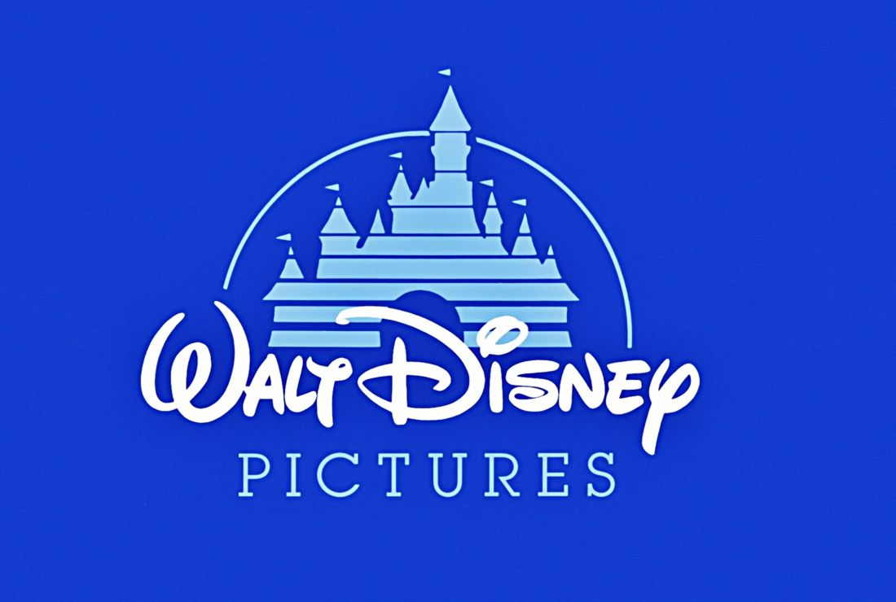

Brand is everything.

This is a point that I was keen to emphasise in my last blog post, and one that I am very much wanting to reiterate again. Essentially, a brand’s identity and core values are often tied in and conveyed by their logo, and the logo often consists of some sort of typographic design. Without a well thought out logo that effectively presents the mentioned above, a brand’s purpose, identity, and intrigue is lost on the audience.

So I thought I would find an example that expressed best the point I am making above. For me it was a no brainer, there was no better brand logo that has been so integral and intertwined with its success, that so effectively conveys its purpose from the get go.

For me this is Disney.

Much of Disney’s logo design is dedicated to showing their advances in in graphics and animation. For a company that stakes its brand on state-of-the-art graphics, it’s important to have a logo that lives up to their reputation.

A lot of attention has been given to the typeface used to spell out the word “Walt Disney” as well. Since the complete Disney logo is so complex, Disney needed a way to more easily brand certain products and productions without having to print the entirety of Cinderella’s castle across them. To do this, Disney came up with a highly unique and recognizable font to spell out “Walt Disney”. In this way, the simplified logo which consists of nothing more than a line of text is still immediately recognizable and inseparable from the brand and its overall message.

Aside from this, though, the design of the Disney logo is meant to convey a sense of wonder and imagination. An objective which I believe has been achieved. When you see the luxurious Cinderella’s castle, you can’t help but wonder what is inside all of those towers and glowing rooms. Through the worlds that they have created, Disney offers a ticket inside, a way to explore realms and possibilities that stretch the mind and put a smile on your face.

But also by having their logo and the entrance to their theme parks look incredibly similar, the Disney logo is also able to serve as an advertisement for Disneyland and Disneyworld. Since every Disney movie starts with an animation of the logo, people who enter into one of the Disney theme parks feel like they are stepping into a real-life Disney movie.

Suffice to say, mission accomplished. Disney’s market value currently lies at around $150 billion and it doesn't take a stretch of the imagagination to see that that is partly due to the logo and typographic design.