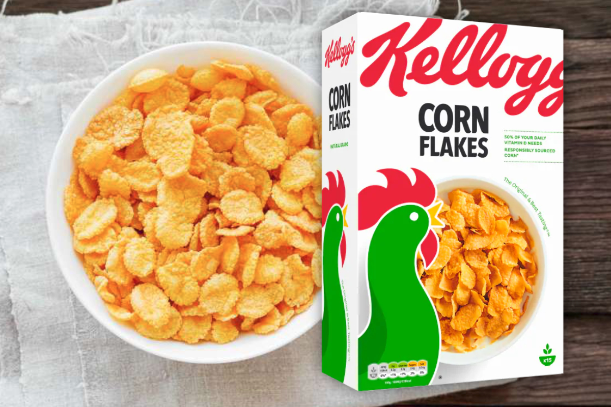
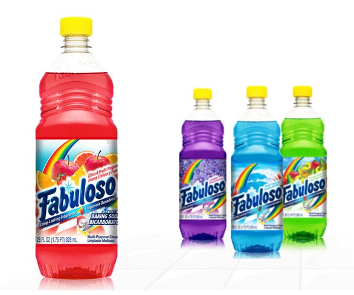
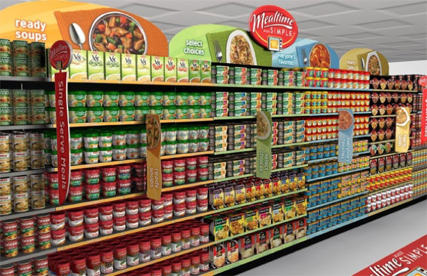

If a picture speaks a thousand words, then why use typography? The answer is simple.

 Brand and balance.

 If say a carton of cereal were only to have an image of a bowl and a child eating from it at a kitchen table in the middle, the equilibrium of the composition would be off. Without typography you are lacking that which anchors a design, provides structure for it and equally guides the buyer’s eye. Yes, your eyes maybe be drawn into the middle and you would be able distinguish what the purpose of the product is, but without clear type you wouldn’t know whose cereal you are eating. And that is essential. 

 Typography allows for not only an overall balance in food packaging’s design, but also provides brands with the chance to present themselves, establish brand recognition and subsequently promote and communicate their individual brand message.

 Take for example Kellogg’s, in it’s over a hundred-year history they have never lacked brand recognition. But it is not simply its century long presence in our lives that have made it so identifiable. When walking down a shopping aisle the striking illustrious red lettering never fails to catch your attention. Beckoning one forward and enticing you to pick up the box. 

Additionally, many food brands have missed the mark on this one, but Kellogg’s excels at presenting itself as a staple of any home, particularly a family centric one. Even the lettering is reminiscent of a shopping list written by mother. It thusly signifies tradition and familiarity, showing reliability in its consistency. Which, regardless of the times, is always a desirable quality in a product. Kellogg’s is shown to be that constant presence in your life, and it is that consistency that is so attractive to consumers. 

 Now let us look as food packaging design gone wrong. 

What does this remind you of? A kid’s fruit drink perhaps or a bottle of refreshing squash? Both of these things couldn’t be further from the truth. It is in fact a cleaning-product that looks dangerously delicious, don’t you think? This packaging design fails to deliver on clarity as you are unable to identify the product in terms of content, purpose and brand identity. Three things that Kellogg’s achieves instantly. 

But arguably the most important thing is shelf impact. Often the best looking design will simply blend in and become invisible, while more simple designs are able to catch the buyers eye more easily. From the shopper’s point of view all they see is vertical patterns of various products and what break their passing gaze is a distinctive look.

 What would you spot first? The busy and multi-coloured cleaning-product, with its clashing images and outdates logo. Or, the simple and concise Kellogg’s box, where the red logo against the white background is projecting itself towards you.