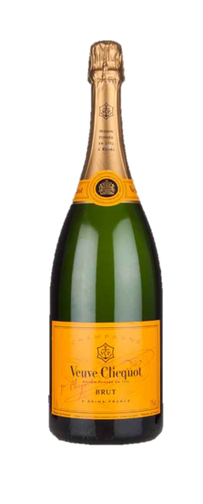
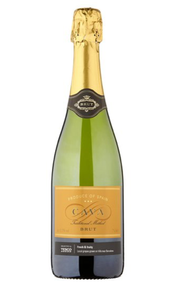
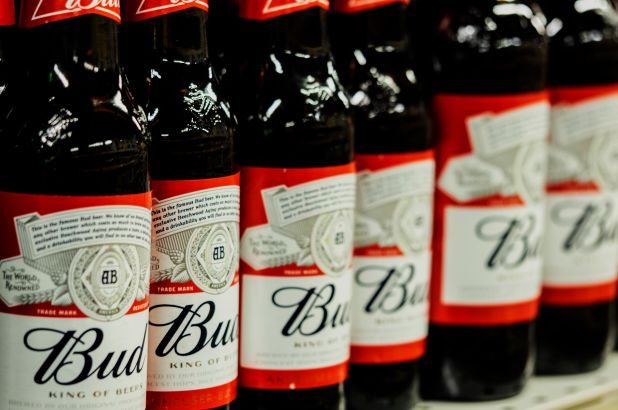

Each bottle of alcohol wants to insight in you an unquenchable thirst that only their product can satisfy. Being able to do that is down to the packaging and labelling of their product, and by association the typography they use. There are hundreds of different alcohols I could analyse, that the writing of even half of would take a dissertation and maybe a book contract.

 So to narrow it down, I will be looking at the typography used in champagne brands in contrast to that of beer brands. Two very different sides of the same coin.

\
\
When we think of champagne we think of luxury, lavishness, exclusivity and indulgence. Something one might drink on a special occasion or the companion to a toast. Whatever the purpose, champagne signifies importance and so the design of the label must reflect this. Likewise, regardless of the brands age or distinction the design needs to signal authenticity and timelessness, looking like a bottle that could be picked out of a dusty wine cellar in the heart of Champagne, France.

Take ***Veuve Cicquot***champagne for example, started in the late 18thcentury the labelling is both distinctive and original, with a bespoke typeface that is recognisable globally. There is almost 300 years backing this company’s design, a heritage that is easily distinguishable by its labelling, but also easily replicated. Just look at the Tesco’s Cava Brut. Coming in at only £5.75 the bottle mirrors both the colouring and letter style of Veuve Cicquot and thusly captures its legacy and quality even if it lacks both. People are vain when buying products, especially champagne, and want a bottle that, irrespective of actual quality, gives of the impression of it. Hence, why there will always be a place in the market for counter fits.

 So if champagne is luxury what is beer? Many would say that it is a national treasure, or a national pass time, the soothing companion after a hard day’s work, or the reward after a good one. Nonetheless, beer is a staple of many people’s life’s the way champagne is but for a few. Successful beer brands, similar to popular champagne brands, give of the impression of tradition and timelessness. But is it all in the design of the label, the same way it is largely for champagne? 

 To a degree, yes. But not entirely.

 Take Budweiser, the brand is not worth £7.4bn and the considered the King of Beer souly because of the impression the label gives. However, that does have something to do with it. 

Looking at the label for the first time with its curvaceous lettering and signature loopy ‘B’, it strikes you as being both traditional and domestic. Like the type of logo that would be a guest for Sunday lunch and would offer to stay a help clean up after. Now that is the kind of impact that only typography can have sway over, with the design of the logo is partly what has made Budweiser a mainstay in today’s culture.

 So to conclude, any successful brand is a marriage between its pre-existing heritage and the initial impact of its packaging. The former being something that every already knows and the latter being something they don’t. All of which, typography has an important influence over.